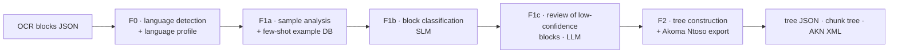

# LegisLeaF

LegisLeaF turns the OCR output of a legal document (a flat list of text blocks)
into a language-aware hierarchical structure: articles, chapters, paragraphs and
points, exported as a JSON tree, a retrieval-oriented chunk tree and an
[Akoma Ntoso](http://www.akomantoso.org/) 3.0 XML document.

## Overview

Legal PDFs are long and hierarchical, and their structure is what gives each
sentence its meaning ("Art. 5, paragraph 2, point b"). OCR engines return the
text but flatten this hierarchy. Regex-only parsers are brittle and tied to one
language and drafting style.

LegisLeaF combines three things:

- **language profiles**: a versioned profile per language, with structural
  keywords, regexes and prompt vocabulary; an LLM generates one when no
  profile exists;
- **model-based classification**: a small model (SLM) classifies every block,
  and a larger LLM reviews the low-confidence ones;
- **deterministic tree construction**: rules turn the classified blocks into a
  validated tree and an Akoma Ntoso document.

Bundled profiles: Italian (`it`), English (`en`), and `paper`, an experimental
profile for scientific papers.

## Architecture



| Phase | Module | Model | Main output (in `<output-dir>/<doc>_output/`) |
|---|---|---|---|
| F0 | `legisleaf.f0.detect_language` | LLM | `language_config.json` |
| F1a | `legisleaf.f1.prepare_analysis` | LLM + encoder | `output_analysis.json`, `embedding_examples_db.npz` |
| F1b | `legisleaf.f1.classify_blocks_slm` | SLM + encoder | `classificazione_blocchi.json`, `classificazione_blocchi_slm_raw.json`, `classificazione_bassa_confidenza.json`, `classificazione_fallimenti.json` |
| F1c | `legisleaf.f1.review_low_conf_llm` | LLM | `classificazione_bassa_confidenza_llm.json`, updated `classificazione_blocchi.json` |
| F2 | `legisleaf.f2.build_tree` (+ `legisleaf.f2.akn`) | none | `struttura_ad_albero.json`, `struttura_rag_graph.json`, `struttura_akn.json`, `documento_akn.xml`, `tree_validation_report.json` |

- **F0:** detects the document language, with an LLM plus a deterministic
  stopword check. If a profile for that language exists in
  `src/legisleaf/config/language_<code>.json`, F0 copies it. Otherwise the LLM
  generates a profile, and F0 validates it. Every later phase reads the
  profile and contains no hardcoded language.
- **F1** (block classification):
  - F1a asks the LLM to analyse a sample of pages and builds a small
    embedding database of labelled examples.
  - F1b classifies every block with the SLM, using few-shot examples retrieved
    from that database. Confidence comes from token logprobs.
  - F1c sends the blocks below `CONFIDENCE_ACCEPT_THRESHOLD` to the LLM for
    review.
- **F2:** builds the hierarchy deterministically. It removes running headers and
  contents pages, repairs article numbering, splits the text into retrieval
  chunks, and serialises the result as Akoma Ntoso 3.0.

A `pipeline_state.json` in each output folder records the completed phases, so
reruns resume where they stopped. It also records the language profile each
artifact was built with: if F0 later detects another language, the downstream
phases run again.

## Repository structure

```text
LegisLeaF/
├── src/legisleaf/
│   ├── run.py            # CLI orchestrator (entry point `legisleaf`)
│   ├── settings.py       # model names, endpoint, output file names
│   ├── model_manager.py  # waits for / optionally starts the model servers
│   ├── common.py         # shared config (F1Config), block loading, I/O helpers
│   ├── language/         # language-profile loading and validation
│   ├── config/           # versioned language profiles (it, en, paper)
│   ├── f0/               # F0: language detection
│   ├── f1/               # F1a, F1b, F1c: block classification
│   └── f2/               # F2: tree construction and Akoma Ntoso export
├── tests/                # pytest suite (offline, no model needed)
├── examples/
│   ├── public_law.json           # sample input (US Public Law 116-207, 7 pages)
│   └── public_law_output/        # its F0/F1 outputs, to run F2 offline
├── LICENSE
├── pyproject.toml
├── .env.example
└── README.md
```

Code comments and log messages are in Italian.

## Requirements

- Python ≥ 3.10.
- Python packages: `openai`, `sentence-transformers`, `torch`, `faiss-cpu`,
  `numpy`, `tqdm`. Optional: `lxml` for XSD validation, `pytest` for the tests.
- **F0 and F1 only:** an OpenAI-compatible chat-completions endpoint serving
  two models:
  - a large instruction-following LLM (default name `nvidia/nemotron-3-super`),
    used by F0, F1a and F1c;
  - a small classifier model (default name `qwen3-classifier`, which is
    Qwen3-30B-A3B-Instruct-2507 in the original setup), used by F1b.
- The endpoint must support `response_format` with a JSON schema. F1b also
  needs `logprobs`.
- F2 needs no model and no GPU.
- Docker is optional. By default LegisLeaF does not start any model server:
  before each model phase it polls `<OPENAI_BASE_URL>/models` for up to 15
  minutes, then fails. The endpoint can be local or remote. Only if
  `DOCKER_COMPOSE_FILE` is set does LegisLeaF start and stop the model
  containers itself.

## Installation

```bash
git clone <repository-url> LegisLeaF
cd LegisLeaF
python -m venv .venv && source .venv/bin/activate   # Windows: .venv\Scripts\activate
# Install the torch build that fits your machine first (CPU or CUDA), see pytorch.org
pip install -e ".[test]"          # add ",xsd" for Akoma Ntoso XSD validation
```

This installs the `legisleaf` command.

## Configuration

All configuration comes from environment variables. `.env.example` lists the
main ones.

| Variable | Default | Purpose |
|---|---|---|
| `OPENAI_BASE_URL` | `http://localhost:8080/v1` | OpenAI-compatible endpoint |
| `OPENAI_API_KEY` | `dummy` | API key; falls back to `OPENROUTER_API_KEY` |
| `LLM_MODEL_NAME_DEFAULT` | `nvidia/nemotron-3-super` | LLM for F0, F1a, F1c |
| `SLM_MODEL_NAME_DEFAULT` | `qwen3-classifier` | SLM for F1b |
| `EMBEDDING_MODEL_NAME` | `paraphrase-multilingual-MiniLM-L12-v2` | encoder for few-shot retrieval |
| `EMBEDDING_DEVICE` | `cuda` (F1b: `cpu`) | set to `cpu` without a GPU |
| `CONFIDENCE_ACCEPT_THRESHOLD` | `0.90` | F1b confidence below which F1c reviews a block |
| `F0_FORCE_LANGUAGE` | – | skip detection, e.g. `en`, `it`, `paper` |
| `DOCKER_COMPOSE_FILE` | – | if set, LegisLeaF starts and stops the model containers itself |
| `AKN_XSD_PATH` | – | Akoma Ntoso XSD used to validate the XML |
| `AKN_DOCUMENT_DATE` | – | act date for the AKN identifiers, when not detected |

For example, with OpenRouter:

```bash
export OPENAI_BASE_URL=https://openrouter.ai/api/v1
export OPENROUTER_API_KEY=<your-key>
export LLM_MODEL_NAME_DEFAULT=<llm-id-on-openrouter>
export SLM_MODEL_NAME_DEFAULT=<slm-id-on-openrouter>
```

Never commit a real key. `.env` is in `.gitignore`.

Many other thresholds can be tuned through environment variables. They are
read at the top of each phase module; `grep getenv src/` lists them.

## Usage

```bash
# Whole pipeline F0 -> F2 on one document
legisleaf --input path/to/document.json --output-dir outputs

# Every *.json in a folder
legisleaf --input-dir path/to/docs --output-dir outputs

# Single phases or ranges
legisleaf --input doc.json --step f0
legisleaf --input doc.json --step f1          # f1a + f1b + f1c
legisleaf --input doc.json --from-step f1b
legisleaf --input doc.json --step f2 --force  # rebuild the tree only

# Many documents: run each phase on all documents before switching model
legisleaf --input-dir docs --phase-first
```

Each phase can also run as a module (`python -m legisleaf.f2.build_tree`). In
that case, set the variables that `legisleaf` normally sets for you:
`BLOCKS_JSON_PATH`, `OUTPUT_DIR`, `DOCUMENT_ID` and `DOCUMENT_NAME`.

## Pipeline

```text
OCR blocks JSON
 ↓  F0   language_config.json
 ↓  F1a  output_analysis.json, embedding_examples_db.npz
 ↓  F1b  classificazione_blocchi.json (+ low-confidence list)
 ↓  F1c  classificazione_blocchi.json (reviewed)
 ↓  F2   struttura_ad_albero.json, struttura_rag_graph.json, struttura_akn.json, documento_akn.xml
```

The input is a JSON file with a `blocks` list, in reading order or with page
indices:

```json
{
  "blocks": [
    {"text": "Art. 1", "page_index": 1, "page_reading_index": 0, "block_type": "heading"},
    {"text": "1. This Act applies to ...", "page_index": 1, "page_reading_index": 1, "block_type": "text"}
  ]
}
```

- **Required:** `text`. The fields `content` and `testo` are accepted as
  aliases.
- **Used when present:** `page_index`, `page_reading_index`, `block_type`, `bbox`,
  plus OCR provenance fields.

LegisLeaF does not do OCR. Produce the blocks with the OCR tool of your choice
and map its output to this schema.

## Example

F2 runs offline on the bundled example, using the F0/F1 outputs shipped with it:

```bash
mkdir -p outputs && cp -r examples/public_law_output outputs/
legisleaf --input examples/public_law.json --step f2 --output-dir outputs
```

The result lands in `outputs/public_law_output/`:

- an Akoma Ntoso act with 7 articles, 32 paragraphs and 47 points;
- `tree_validation_report.json`, which reports `"valido": true`.

To run the full pipeline on the same input, you need a configured model
endpoint:

```bash
legisleaf --input examples/public_law.json --output-dir outputs --force
```

## Tests

```bash
pytest
```

The suite has 155 tests and runs offline in a few seconds. It covers:

- language profiles;
- F1 confidence and JSON repair;
- the tree and Akoma Ntoso builders;
- the orchestrator's resume and phase-first logic.

It does not call any model.

## Data

- **Included:**
  - `examples/public_law.json`: the OCR blocks of US Public Law 116-207, a US
    federal document in the public domain;
  - `examples/public_law_output/`: its F0/F1 outputs, with paths made relative;
  - `src/legisleaf/config/`: the language profiles.
- **Not included:**
  - the corpus used to develop the framework (EU and Italian legislation, US
    regulations);
  - OCR ensemble outputs;
  - evaluation gold standards;
  - model weights.

  The source legal texts are publicly available from their official portals
  (EUR-Lex, Normattiva, govinfo.gov).
- **Downloaded at first use:** the encoder model, from the Hugging Face Hub.

## Reproducibility

- **F2** is deterministic: the same F1 output always gives the same tree and
  the same XML. Only the absolute input paths recorded in the JSON metadata
  change.
- **F0 and F1** depend on:
  - the served models and their exact versions;
  - the sampling parameters (requests use `temperature=0`);
  - the encoder;
  - the `torch` build, since CPU and GPU embeddings differ in the last digits.

  Record `OPENAI_BASE_URL`, the model names and the package versions with
  every run.
- `pipeline_state.json` and `language_config.json` in each output folder record
  which profile and phases produced the artifacts.

## Limitations

- **Supported languages:** Italian and English have tuned profiles. Profiles
  for other languages are generated by the LLM and have not been validated
  against real documents. `paper` is experimental.
- **Model requirements:** F0 and F1 need a JSON-schema-capable
  endpoint. Without logprobs, F1b has no confidence, so every block that isn't
  matched deterministically goes to F1c for review (slower, more LLM calls).
- **Input:** the output quality depends on the OCR input. LegisLeaF does not
  fix reading order or text errors.
- **Metadata:** Akoma Ntoso metadata (date, number) are recognised with
  heuristics. Missing values fall back to placeholders such as `1970-01-01`,
  which `AKN_DOCUMENT_DATE` and related variables can override.
- **Language:** code comments, log messages and some output field names are
  in Italian.

## Citation

LegisLeaF was developed as part of a master's thesis by Leonardo Venturini:

> *LegisLeaF: Reconstructing the Logical Structure of Legal Documents from Flat
> Extractions. A Profile-Driven Framework and Its Structural Evaluation.*
> Master's thesis, 2026.

No DOI exists yet.

## License

LegisLeaF is released under the
[GNU Affero General Public License v3.0](LICENSE) (AGPL-3.0).
